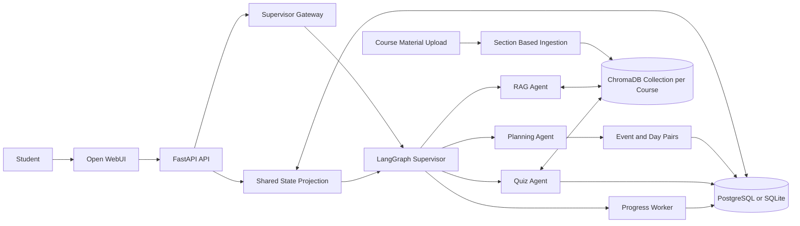
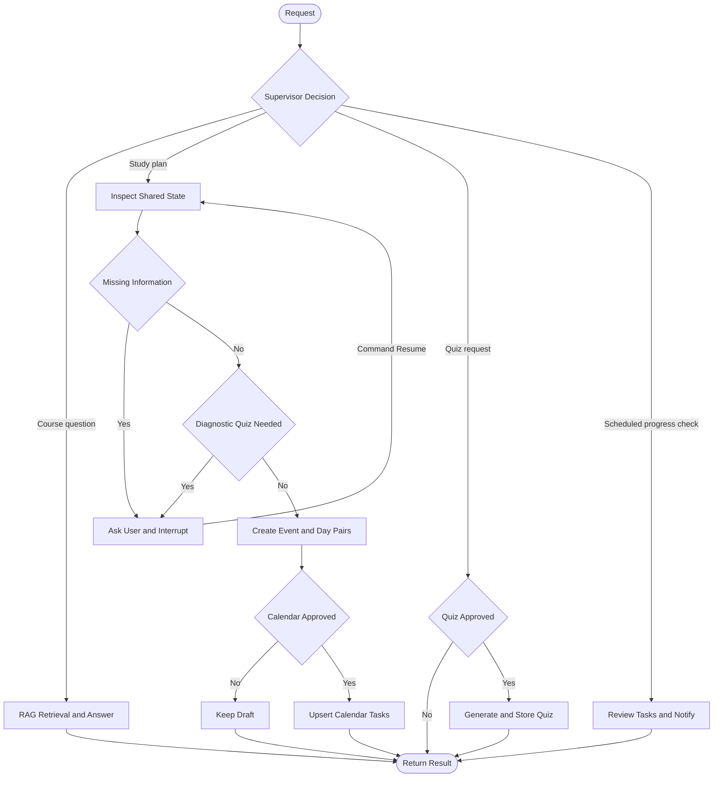

# Nahaj

Nahaj is an agentic semester assistant for university students. It combines course-material search, semester planning, quiz generation, progress tracking, and a calendar in one conversation. The backend owns the academic data and agent workflow, while Open WebUI provides the chat and calendar interface.

The system uses a LangGraph supervisor to route requests to specialized agents. The agents share semester, course, plan, task, and quiz-performance state, and the workflow pauses for the student whenever information or approval is required.

## Project Overview

### Problem

Students often keep lecture files, deadlines, study plans, quizzes, and progress records in separate tools. This makes it difficult to decide what to study next, connect questions to reliable course material, and adapt a plan after completing tasks or quizzes.

Nahaj provides one system where a student can:

- Upload and organize course material.
- Ask questions grounded in the uploaded material.
- Generate a semester study plan based on deadlines and progress.
- Create practice quizzes that focus on weak or unfinished topics.
- Track tasks, quiz performance, and notifications.
- Approve every generated quiz and every calendar change before it is created.

### Target Users

The primary users are university students managing several courses during a semester. The current deployment is intentionally single-user.

### Why an Agentic System

The work contains different responsibilities and decision rules. Retrieval requires document indexing and ranking, planning requires a semester-wide view of state, and quiz generation requires a separate candidate-selection pipeline. Specialized agents keep these responsibilities clear, while one supervisor gives the student a single conversational entry point.

The architecture uses hierarchical delegation: the supervisor makes a structured routing decision, and the selected specialist completes the task. The planning flow also uses a plan-and-execute pattern by inspecting the shared state, requesting missing information or approval, producing event and day pairs, and applying approved events to the calendar.

## Architecture



The shared state is projected from the application database before every chat request. It contains:

- Semester name, dates, and timezone.
- Courses and deadlines.
- Course-material titles and slide or page counts.
- Completed topics.
- Current plans, completed tasks, and remaining tasks.
- Quiz performance and estimated mastery by topic.

LangGraph checkpoint state is separate from the academic shared state. It keeps pending questions and approvals associated with the current chat thread.

## Agents and Their Roles

| Component | Responsibility |
| --- | --- |
| Supervisor agent | Uses structured output to route a student request to the RAG, planning, or quiz agent. A deterministic keyword fallback remains available when no model is configured. |
| RAG agent | Retrieves the three most relevant course-material chunks and generates a grounded answer with citations. |
| Planning agent | Reviews the whole semester, course library metadata, deadlines, completed work, current plan, remaining work, and quiz performance. It requests missing information, can request an approved diagnostic quiz, and produces study and assessment events. |
| Quiz agent | Divides material into parts, generates candidate multiple-choice questions, and makes the final selection using weak topics, requested topics, completed topics, and remaining tasks from the shared state. |
| Progress worker | Runs independently of direct user routing, summarizes task completion, detects overdue work, and creates deduplicated notifications. |

The approval and document nodes in the graph are workflow nodes rather than additional agents. The approval node provides one stable place for LangGraph to pause and resume planning or quiz work.

## Workflow and Orchestration



The supervisor is the main decision point. Planning adds further decisions for missing data, diagnostic-quiz approval, and calendar approval. LangGraph `interrupt` and `Command(resume=...)` preserve the active flow between chat turns.

### Planning Flow

1. Read the current shared state and high-level course library.
2. Ask the student for required missing information, such as semester dates.
3. Check whether low or uncertain mastery justifies a quick diagnostic quiz.
4. Request permission before generating that quiz.
5. Build a draft containing what to study and scheduled exams, quizzes, or other assessments.
6. Return structured `event` and `day` pairs.
7. Request permission before adding the events to the calendar.
8. Convert approved events into idempotent task updates in the database.

### Quiz Flow

1. Ask for the student's approval.
2. Retrieve source material for the selected course or weak topics.
3. Divide the material into named parts.
4. Generate a pool of four-option multiple-choice candidates.
5. Select the final questions using the learner's shared state.
6. Store the quiz while keeping its answer key hidden until an attempt is completed.

## RAG Pipeline

### Ingestion

Course material is ingested once when a document is uploaded. Old exams in the `past_exam` collection are stored by the application but are not added to the course-material RAG index.

The ingestor:

- Extracts text from PDF, PPTX, DOCX, text, Markdown, or HTML sources supported by the ingestion module.
- Detects headings and creates section-based chunks.
- Splits large sections with a default size of 400 words and 50 words of overlap.
- Stores chunks in a persistent ChromaDB collection dedicated to the course.
- Replaces chunks for the same document ID on retry, making ingestion idempotent.

### Retrieval

For each query, the retriever:

1. Loads the indexed chunks for the selected course.
2. Ranks them with BM25 lexical similarity.
3. Ranks them with Chroma cosine similarity.
4. Combines both rankings with Reciprocal Rank Fusion.
5. Returns the top three chunks.

### Generation

The RAG agent sends only the selected course-material context and the student's question to the configured language model. The prompt requires the model to stay within that context, say when the material is insufficient, and cite supporting chunks.

## Tools and Technologies

| Area | Technology | Use |
| --- | --- | --- |
| Agent orchestration | LangGraph | Conditional routing, checkpoints, interrupts, and approval resumes. |
| Language model | OpenRouter through LangChain | Structured supervisor routing, grounded answers, and optional quiz candidate generation. |
| Retrieval | ChromaDB, BM25, cosine similarity, RRF | Persistent hybrid retrieval for each course. |
| Backend API | Python 3.12, FastAPI, Pydantic | Domain API, validation, streaming chat, and supervisor event handling. |
| Data | SQLAlchemy, Alembic, PostgreSQL or SQLite | Semester, course, document, plan, quiz, attempt, progress, and notification persistence. |
| File reading | PyPDF and Office XML readers | Text extraction and slide or page counting. |
| User interface | Open WebUI v0.11.3 | Chat history, course context, quizzes, plan, progress, and calendar views. |
| Deployment and tests | Docker Compose and pytest | Reproducible services and automated API tests. |

## Security and Guardrails

Nahaj implements several safety controls:

- **Bearer authentication:** every endpoint except `/health` requires the configured `NAHAJ_API_KEY`.
- **Upload validation:** filenames, extensions, media types, file signatures, file size, duplicate hashes, and resolved storage paths are checked before a file is accepted.
- **Human approval:** quizzes are never generated from a request without approval, and study-plan events are never written to the calendar without approval.
- **Quiz-answer protection:** correct option IDs and explanations are hidden while an attempt is in progress and are returned only after completion.
- **Domain validation:** task ranges, statuses, quiz options, collections, and referenced course IDs are validated before database writes.
- **Grounded RAG output:** the generation prompt limits answers to retrieved course material and requires a clear response when the context is insufficient.

The upload tests include a path-traversal attempt using an unsafe filename, which verifies one of the security boundaries.

## Monitoring and Logging

The current implementation provides lightweight observability suitable for the project scope:

- The project logger records UTC timestamps without using Python's `logging` library.
- API lifecycle events and every HTTP request record a request ID, method, path, client, status, and duration.
- Supervisor, streaming, document-ingestion, document-removal, and progress-check failures include their error message.
- Logs are printed to stdout and appended to `NAHAJ_LOG_FILE` (`./logs/nahaj.log` locally and `/data/logs/nahaj.log` in Docker).
- Authorization values, request bodies, API keys, and uploaded file contents are intentionally excluded.
- Each uploaded document records `processing`, `ready`, or `failed` status and stores the failure message.
- Progress, quiz attempts, task completion, and notifications remain queryable in the database.
- Notification deduplication prevents repeated alerts for the same condition.

Distributed tracing, per-node timing, model token metrics, and a monitoring dashboard are listed under future improvements rather than claimed as current features.

## Project Structure

```text
Nahaj/
├── backend/
│   ├── agents.py                 # Shared state and specialist agents
│   ├── workflow.py               # LangGraph supervisor workflow
│   ├── rag_ingestion.py          # Section chunking and Chroma ingestion
│   ├── rag_retrieval.py          # BM25, cosine ranking, and RRF
│   ├── config.py                 # OpenRouter language-model configuration
│   ├── supervisor_contract.py    # API-to-workflow gateway contract
│   ├── main.py                   # FastAPI routes and event application
│   ├── models.py                 # SQLAlchemy models
│   ├── schemas.py                # API schemas and validation
│   ├── database.py               # Database engine and sessions
│   ├── logger.py                 # Timestamped stdout and file logger
│   ├── alembic/                  # Database migrations
│   ├── tests/                    # Automated API tests
│   ├── Dockerfile
│   └── requirements.txt
├── frontend/                     # Customized Open WebUI application
├── alembic.ini
├── docker-compose.yaml
└── README.md
```

## Installation and Setup

### Docker Compose

Docker Compose is the recommended way to run the complete application.

1. Clone the project and enter its directory:

   ```bash
   git clone https://github.com/majedco03/Nahaj.git
   cd Nahaj
   ```

2. Create a root `.env` file. Do not commit this file:

   ```dotenv
   NAHAJ_API_KEY=replace-with-a-private-key
   OPENROUTER_API_KEY=replace-with-your-openrouter-key
   OPENROUTER_MODEL=replace-with-an-openrouter-model-id
   ```

3. Build and start the services:

   ```bash
   docker compose up --build
   ```

   Alembic migrations run automatically when the API container starts.

4. Open [http://localhost:3000](http://localhost:3000).

5. Stop the application with:

   ```bash
   docker compose down
   ```

The browser accesses the private API through Open WebUI's same-origin `/api/nahaj/*` proxy. PostgreSQL, uploaded files, application logs, the course Chroma index, and Open WebUI data are stored in Docker volumes.

### Local Backend

Python 3.12 is recommended because it matches the backend container.

```bash
python3.12 -m venv .venv
source .venv/bin/activate
python -m pip install --upgrade pip
python -m pip install -r backend/requirements.txt

export DATABASE_URL=sqlite:///./nahaj.db
export UPLOAD_DIR=./uploads
export NAHAJ_LOG_FILE=./logs/nahaj.log
export NAHAJ_API_KEY=dev-key
export SUPERVISOR_FACTORY=backend.workflow:create_supervisor
export OPENROUTER_API_KEY=replace-with-your-openrouter-key
export OPENROUTER_MODEL=replace-with-an-openrouter-model-id
export PROGRESS_SCHEDULER_ENABLED=false

alembic upgrade head
uvicorn backend.main:app --reload
```

The local API runs at `http://127.0.0.1:8000`. Full RAG answer generation requires both OpenRouter variables. Without them, the graph can still use deterministic routing and non-LLM planning behavior, but it cannot produce a model-generated course answer.

### Configuration

| Variable | Default | Purpose |
| --- | --- | --- |
| `DATABASE_URL` | `sqlite:///./nahaj.db` | SQLAlchemy database connection. Docker overrides this with PostgreSQL. |
| `UPLOAD_DIR` | `./uploads` | Original documents and the default Chroma directory. |
| `CHROMA_DIR` | `<UPLOAD_DIR>/.chroma` | Optional custom Chroma persistence path. |
| `NAHAJ_LOG_FILE` | `./logs/nahaj.log` | File that receives a persistent copy of every application log line. |
| `NAHAJ_API_KEY` | `dev-key` | Bearer key protecting the API. Use a private value outside development. |
| `SUPERVISOR_FACTORY` | Empty locally | Gateway factory. Use `backend.workflow:create_supervisor`. |
| `OPENROUTER_API_KEY` | None | OpenRouter credential used by the agents. |
| `OPENROUTER_MODEL` | None | OpenRouter model identifier. |
| `AGENT_TEMPERATURE` | `0` | Model temperature. |
| `AGENT_TIMEOUT_SECONDS` | `45` | Model request timeout. |
| `AGENT_MAX_RETRIES` | `2` | Model retry count. |
| `PROGRESS_SCHEDULER_ENABLED` | `true` | Enables automatic progress checks. |
| `PROGRESS_CHECK_INTERVAL_MINUTES` | `15` | Time between automatic progress checks. |
| `MAX_UPLOAD_BYTES` | `52428800` | Maximum upload size, 50 MiB by default. |
| `NAHAJ_TIMEZONE` | `Asia/Riyadh` | Default application timezone. |

## How to Use the Project

1. Create the active semester and enter its start date, end date, and timezone.
2. Add the semester's courses.
3. Upload lecture slides or other course material to the `slides` collection. The document moves from `processing` to `ready` after one-time ingestion.
4. Upload old exams separately to `past_exam` when needed; they are not indexed as course-material RAG context.
5. Select a course in chat and ask a question about its material.
6. Ask for a study plan. Answer any missing-information questions, then approve or reject the proposed calendar events.
7. Ask for a quiz, approve its generation, open it from the returned link, and complete the attempt.
8. Review the plan, calendar, progress page, and notifications as the shared state changes.

Example requests:

```text
Explain the difference between merge sort and quicksort from my slides.
Create a study plan for the rest of the semester.
Give me a three-question quiz on the topics I am weak in.
```

## Testing

Install the backend dependencies, then run:

```bash
python -m compileall -q backend
pytest -q
docker compose config --quiet
```

The current automated suite contains 14 tests: seven API tests, six guardrail tests, and one logger test. It covers the required categories:

| Category | Covered Scenarios |
| --- | --- |
| Normal behavior | Health response, semester and course creation, calendar plan projection, task completion, quiz attempts, grading, and notifications. |
| Invalid input | Invalid course data, unsupported model selection, unsafe uploads, and duplicate documents. |
| Failure behavior | Missing supervisor configuration and stable API error responses. |
| Security behavior | Missing or invalid bearer authentication, prompt-injection attempts, poisoned RAG context, unsafe model output, path-traversal filenames, upload signatures, and answer-key hiding before quiz completion. |

Useful manual workflow checks are:

- Upload course material and confirm a grounded answer returns no more than three citations.
- Request a plan with missing semester dates and confirm the graph resumes after the answer.
- Reject and approve quick-quiz requests to confirm both branches.
- Reject and approve calendar changes to confirm that only approved events create tasks.
- Complete a quiz and confirm its topic performance appears in the next planning-state snapshot.

## Current Limitations and Future Improvements

- Replace the in-memory LangGraph checkpointer with a persistent database-backed checkpointer so pending approvals survive API restarts.
- Add PII filtering and role-based access control for a future multi-user deployment, and broaden the existing prompt-injection detection coverage.
- Add structured per-node traces, model and retrieval timing, token usage, and an observability dashboard.
- Resume an interrupted planning workflow automatically after the requested diagnostic quiz is completed.
- Add richer natural-language date parsing and student-controlled study-time preferences.
- Add OCR so PNG and JPEG course uploads can contribute text to the RAG index.
- Add direct synchronization with external calendar providers.
- Expand automated tests around graph routing, chained approvals, retrieval fusion, and model failures.

## Repository Links

- Project repository: [github.com/majedco03/Nahaj](https://github.com/majedco03/Nahaj)
- SDAIA Academy: [github.com/SDAIAAcademy](https://github.com/SDAIAAcademy)

Submit the project repository link through the Google Form supplied for the course.
