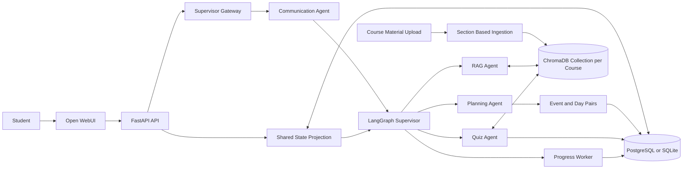
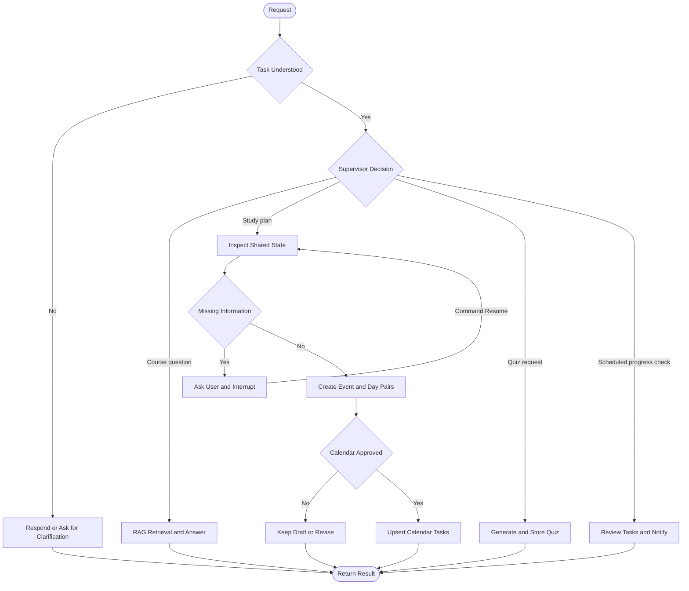

# Nahaj

Nahaj is an agentic semester assistant for university students. It combines course-material search, semester planning, quiz generation, progress tracking, and a calendar in one conversation. The backend owns the academic data and agent workflow, while Open WebUI provides the chat and calendar interface.

The system uses a communication agent to clarify requests before a LangGraph supervisor routes understood tasks to specialized agents. The agents share semester, course, plan, task, and quiz-performance state, and the workflow pauses for the student whenever information or approval is required.

## Project Overview

### Problem

Students often keep lecture files, deadlines, study plans, quizzes, and progress records in separate tools. This makes it difficult to decide what to study next, connect questions to reliable course material, and adapt a plan after completing tasks or quizzes.

Nahaj provides one system where a student can:

- Upload and organize course material.
- Ask questions grounded in the uploaded material.
- Generate a semester study plan based on deadlines and progress.
- Create practice quizzes that focus on weak or unfinished topics.
- Track tasks, quiz performance, and notifications.
- Approve every calendar change before it is written.

### Target Users

The primary users are university students managing several courses during a semester. The current deployment is intentionally single-user.

### Why an Agentic System

The work contains different responsibilities and decision rules. Retrieval requires document indexing and ranking, planning requires a semester-wide view of state, and quiz generation requires a separate candidate-selection pipeline. Specialized agents keep these responsibilities clear, while one supervisor gives the student a single conversational entry point.

The architecture uses hierarchical delegation: the supervisor makes a structured routing decision, and the selected specialist completes the task. The planning flow also uses a plan-and-execute pattern by inspecting the shared state, requesting missing information or approval, designing a schedule over a grounded set of candidates, producing event and day pairs, and applying approved events to the calendar.

## Architecture



The shared state is projected from the application database before every chat request. It contains:

- Semester name, dates, and timezone.
- Courses and deadlines.
- Course-material titles and slide or page counts.
- Completed topics.
- Current plans, completed tasks, and remaining tasks.
- Quiz performance and estimated mastery by topic.

LangGraph checkpoint state is separate from the academic shared state. It keeps pending questions and approvals associated with the current chat thread.

## Agents and Their Roles

| Component | Responsibility |
| --- | --- |
| Communication agent | Handles greetings and unclear requests, forwards only understood tasks, and distinguishes approval answers from unrelated new work. It reads the recent conversation, resolves references such as it or the same one, carries forward a course, chapter, or count the student already gave, and does not ask again for something already stated. |
| Supervisor agent | Uses strict structured OpenRouter output to route a student request to the RAG, planning, or quiz agent. It sees the student's original message, the communication agent's rewritten task, and the recent turns, and routes on the original wording whenever the two disagree. Each decision carries a short reason, which is logged. |
| RAG agent | Retrieves the three most relevant course-material chunks and generates a grounded answer with citations. |
| Planning agent | Reviews the whole semester, course library metadata, deadlines, completed work, current plan, remaining work, and quiz performance. It sizes each piece of work from document length and mastery, then designs the schedule with the model over a grounded candidate set. It requests missing information and produces study and assessment events. Quiz performance is read as evidence; the planner never creates a quiz. |
| Quiz agent | Reads its own scope from the request and the conversation, including how many questions to ask for and which chapters to cover. It then divides material into parts, generates a candidate pool sized to that request, and makes the final selection using weak topics, requested topics, completed topics, and remaining tasks from the shared state. |
| Progress worker | Runs independently of direct user routing, summarizes task completion, detects overdue work, and creates deduplicated notifications. |

The approval and document nodes in the graph are workflow nodes rather than additional agents. The approval node provides one stable place for LangGraph to pause and resume planning work.

## Workflow and Orchestration



The communication agent is the user-facing decision point, and the supervisor coordinates only understood tasks. Because a rewritten task can lose the detail that decides the route, the supervisor is given the student's own words and the preceding turns alongside it, and treats the original wording as the authority. A quiz the student asks for is created straight away, because the request is itself the instruction. Planning adds further decisions for missing data and calendar approval. LangGraph `interrupt` and `Command(resume=...)` preserve the active flow between chat turns.

### Planning Flow

1. Read the current shared state and high-level course library.
2. Ask the student for required missing information, such as semester dates.
3. Collect scheduling candidates from remaining tasks, deadlines, uncompleted material, and weak quiz topics.
4. Size every candidate into study sessions from its page or slide count and its estimated mastery.
5. Ask the model to design the schedule over that candidate set, giving it the student's own request so it can narrow the scope, then validate the result.
6. Build a draft containing what to study and scheduled exams, quizzes, or other assessments.
7. Return structured `event` and `day` pairs, plus a revision diff against the previous plan.
8. Request permission before adding the events to the calendar.
9. Treat any answer to that question that is neither an approval nor a refusal as a revision instruction, and redraft the plan with it.
10. Convert approved events into idempotent task updates in the database.

#### How the Schedule Is Designed

The planner separates grounding from design. Candidate collection is deterministic, so
the model can never invent a course, document, topic, or deadline. Every judgement over
those candidates belongs to the model: how many sessions each one needs, what order they
happen in, how heavy a day may be, and how far out the plan runs. Page count and mastery
are turned into a `suggested_sessions` and `suggested_priority` figure and handed over as
a starting point, not as a rule the model has to obey.

| Input | Effect on the plan |
| --- | --- |
| Document length | Pages or slides become study sessions, so a long chapter is spread over several days and a short deck takes one. |
| Quiz performance | Mastery scales a topic's depth and its priority, and a weak topic also earns its own revision task. |
| Completed topics and tasks | Finished work is excluded, and completion history becomes the pace signal. |
| Remaining tasks | Carried forward as candidates; sessions from an earlier plan collapse back into the work they came from. |
| Current plan | Supplied to the model so it can keep dates that still work, and diffed afterwards into kept, rescheduled, added, and dropped. |
| The student's request | Passed into the design step. When it narrows the plan to one chapter, one exam, or one date range, the model marks everything else excluded with a reason, and only the remaining candidates are scheduled. When it sets a day to finish by, the model returns that day as a horizon and the daily load needed to reach it. |

Every designed session is then validated against the collected candidates: a session
referencing an unknown candidate is rejected, a date outside the plan window is
rescheduled, the daily session limit is never exceeded, a candidate given fewer sessions
than the model itself asked for is topped up to that number, and any candidate the model
neither scheduled nor excluded is added by the rule scheduler. Excluding every candidate
is ignored, since an empty plan is never the answer.

When the request sets a finish date, that date bounds the plan window and the daily load
rises as far as needed to fit the work inside it, up to a hard ceiling. If the work still
does not fit, it runs past the date rather than stacking onto an overloaded day, and the
result records `horizon_met: false` so the student is told the date was missed instead of
being shown a plan that quietly ignores it. A revision that reproduces exactly the draft
the student just rejected is reported as an unapplied change, with the constraint that
blocked it, rather than presented again as if it were new. If the model is
unavailable or returns nothing usable, the same effort-aware rule scheduler produces
the whole plan, so planning never fails for want of a model. `design.source` in the
result records which path produced the schedule.

### Quiz Flow

1. Read the requested scope from the student's words and the conversation: how many questions, which chapters or topics, and which course. A number naming a chapter or a page is not treated as a question count.
2. Retrieve source material for the selected course or weak topics.
3. Divide the material into named parts.
4. Generate a pool of four-option multiple-choice candidates, at least twice the requested question count so the selection is a real choice.
5. Select the final questions using the learner's shared state.
6. Say so plainly when the material could only support fewer questions than were asked for.
7. Store the quiz while keeping its answer key hidden until an attempt is completed.

#### Finding the Material

The shared state carries document titles and page counts but no document text, so a quiz
is always built from retrieved chunks. The course is chosen by matching the request
against course names, course codes, and document titles rather than defaulting to the
first course on file, and an explicit course from the request context always wins. If the
chosen course yields nothing, the remaining courses with material are tried before the
attempt is abandoned.

When no quiz can be built, the reason is reported rather than assumed. Retrieval failures
are logged with the course ID instead of being reported as an empty library, and the
student is told which of these actually happened: no documents at all, documents that are
still being indexed, or documents that are ready but whose search index cannot be read.

## RAG Pipeline

### Ingestion

Course material is ingested once when a document is uploaded. Old exams in the `past_exam` collection are stored by the application but are not added to the course-material RAG index.

The ingestor:

- Extracts text from PDF, PPTX, DOCX, text, Markdown, or HTML sources supported by the ingestion module.
- Detects headings and creates section-based chunks.
- Splits large sections with a default size of 400 words and 50 words of overlap.
- Generates deterministic embeddings locally, so indexing does not download a model or send document contents to an embedding provider.
- Stores chunks in a persistent ChromaDB collection dedicated to the course.
- Replaces chunks for the same document ID on retry, making ingestion idempotent.
- Resumes documents left in `processing` when the API restarts.

### Retrieval

For each query, the retriever:

1. Loads the indexed chunks for the selected course.
2. Ranks them with BM25 lexical similarity.
3. Ranks them with Chroma cosine similarity.
4. Combines both rankings with Reciprocal Rank Fusion.
5. Returns the top three chunks.

### Generation

The RAG agent sends only the selected course-material chunks and the student's question to OpenRouter. The prompt requires the model to stay within that context, say when the material is insufficient, and cite supporting chunks. Configure OpenRouter only when sending this data to the provider is acceptable for the deployment.

Nahaj does not substitute canned or extractive answers when the language model is unavailable. Communication, coordination, RAG generation, planning narration, and quiz generation fail explicitly so configuration and provider problems remain visible.

## Tools and Technologies

| Area | Technology | Use |
| --- | --- | --- |
| Agent orchestration | LangGraph | Conditional routing, checkpoints, interrupts, and approval resumes. |
| Language model | OpenRouter Chat Completions API | Communication, strict structured routing, grounded answers, planning narration, and quiz generation. |
| Retrieval | ChromaDB, BM25, cosine similarity, RRF | Persistent hybrid retrieval for each course. |
| Backend API | Python 3.12, FastAPI, Pydantic | Domain API, validation, streaming chat, and supervisor event handling. |
| Data | SQLAlchemy, Alembic, PostgreSQL or SQLite | Semester, course, document, plan, quiz, attempt, progress, and notification persistence. |
| File reading | PyPDF and Office XML readers | Text extraction and slide or page counting. |
| User interface | Open WebUI v0.11.3 | Chat history, course context, quizzes, plan, progress, and calendar views. |
| Deployment and tests | Docker Compose and pytest | Reproducible services and automated API tests. |

## Security and Guardrails

Nahaj implements several safety controls:

- **Bearer authentication:** every endpoint except `/health` requires the configured `NAHAJ_API_KEY`.
- **Upload validation:** filenames, extensions, media types, file signatures, file size, duplicate hashes, and resolved storage paths are checked before a file is accepted.
- **Human approval:** study-plan events are never written to the calendar without approval. A quiz the student asks for directly needs no approval, since the request is the instruction.
- **Quiz-answer protection:** correct option IDs and explanations are hidden while an attempt is in progress and are returned only after completion.
- **Domain validation:** task ranges, statuses, quiz options, collections, and referenced course IDs are validated before database writes.
- **Grounded RAG output:** the generation prompt limits answers to retrieved course material and requires a clear response when the context is insufficient.

The upload tests include a path-traversal attempt using an unsafe filename, which verifies one of the security boundaries.

## Monitoring and Logging

The current implementation provides lightweight observability suitable for the project scope:

- The project logger records UTC timestamps without using Python's `logging` library.
- API lifecycle events and every HTTP request record a request ID, method, path, client, status, and duration.
- Supervisor, streaming, document-ingestion, document-removal, and progress-check failures include their error message.
- Communication decisions and coordinator routes record the request and thread IDs without logging message bodies.
- Logs are printed to stdout and appended to `NAHAJ_LOG_FILE`. By default, `nahaj.log` is visible in the project root both locally and with Docker Compose.
- Authorization values, request bodies, API keys, and uploaded file contents are intentionally excluded.
- Each uploaded document records `processing`, `ready`, or `failed` status and stores the failure message.
- Progress, quiz attempts, task completion, and notifications remain queryable in the database.
- Notification deduplication prevents repeated alerts for the same condition.

Distributed tracing, per-node timing, model token metrics, and a monitoring dashboard are listed under future improvements rather than claimed as current features.

## Project Structure

```text
Nahaj/
├── backend/
│   ├── agents.py                 # Shared state and specialist agents
│   ├── workflow.py               # LangGraph supervisor workflow
│   ├── rag_ingestion.py          # Section chunking and Chroma ingestion
│   ├── rag_retrieval.py          # BM25, cosine ranking, and RRF
│   ├── config.py                 # OpenRouter language-model configuration
│   ├── supervisor_contract.py    # API-to-workflow gateway contract
│   ├── main.py                   # FastAPI routes and event application
│   ├── models.py                 # SQLAlchemy models
│   ├── schemas.py                # API schemas and validation
│   ├── database.py               # Database engine and sessions
│   ├── logger.py                 # Timestamped stdout and file logger
│   ├── alembic/                  # Database migrations
│   ├── guardrails.py             # Prompt-injection and output validation
│   ├── tests/                    # API, guardrail, planning, quiz, and routing tests
│   ├── Dockerfile
│   └── requirements.txt
├── frontend/                     # Customized Open WebUI application
├── alembic.ini
├── docker-compose.yaml
└── README.md
```

## Installation and Setup

### Docker Compose

Docker Compose is the recommended way to run the complete application.

1. Clone the project and enter its directory:

   ```bash
   git clone https://github.com/majedco03/Nahaj.git
   cd Nahaj
   ```

2. Create a root `.env` file. Do not commit this file:

   ```dotenv
   NAHAJ_API_KEY=replace-with-a-private-key
   OPENROUTER_API_KEY=replace-with-your-openrouter-key
   OPENROUTER_MODEL=openai/gpt-5.6-luna
   ```

3. Build and start the services:

   ```bash
   docker compose up --build
   ```

   Alembic migrations run automatically when the API container starts.

4. Open [http://localhost:3000](http://localhost:3000).

5. Stop the application with:

   ```bash
   docker compose down
   ```

The browser accesses the private API through Open WebUI's same-origin `/api/nahaj/*` proxy. PostgreSQL, uploaded files, application logs, the course Chroma index, and Open WebUI data are stored in Docker volumes.

### Local Backend

Python 3.12 is recommended because it matches the backend container.

```bash
python3.12 -m venv .venv
source .venv/bin/activate
python -m pip install --upgrade pip
python -m pip install -r backend/requirements.txt

export DATABASE_URL=sqlite:///./nahaj.db
export UPLOAD_DIR=./uploads
export NAHAJ_LOG_FILE=./nahaj.log
export NAHAJ_API_KEY=dev-key
export SUPERVISOR_FACTORY=backend.workflow:create_supervisor
export OPENROUTER_API_KEY=replace-with-your-openrouter-key
export OPENROUTER_MODEL=openai/gpt-5.6-luna
export PROGRESS_SCHEDULER_ENABLED=false

alembic upgrade head
uvicorn backend.main:app --reload
```

The local API runs at `http://127.0.0.1:8000`. Both OpenRouter variables are required for user chat. `OPENROUTER_MODEL` must be the complete OpenRouter identifier, including the provider prefix, such as `openai/gpt-5.6-luna`. Missing credentials, invalid model output, and provider errors produce an explicit request error; Nahaj does not return a fallback answer.

### Configuration

| Variable | Default | Purpose |
| --- | --- | --- |
| `DATABASE_URL` | `sqlite:///./nahaj.db` | SQLAlchemy database connection. Docker overrides this with PostgreSQL. |
| `UPLOAD_DIR` | `./uploads` | Original documents and the default Chroma directory. |
| `CHROMA_DIR` | `<UPLOAD_DIR>/.chroma` | Optional custom Chroma persistence path. |
| `NAHAJ_LOG_FILE` | `<project root>/nahaj.log` | File that receives a persistent copy of every application log line. |
| `NAHAJ_API_KEY` | `dev-key` | Bearer key protecting the API. Use a private value outside development. |
| `SUPERVISOR_FACTORY` | Empty locally | Gateway factory. Use `backend.workflow:create_supervisor`. |
| `OPENROUTER_API_KEY` | None | OpenRouter credential used by the agents. |
| `OPENROUTER_MODEL` | None | Full OpenRouter model identifier, including its provider prefix. |
| `AGENT_TEMPERATURE` | `0` | Model temperature. |
| `AGENT_TIMEOUT_SECONDS` | `45` | Model request timeout. |
| `AGENT_MAX_RETRIES` | `2` | Model retry count. |
| `PROGRESS_SCHEDULER_ENABLED` | `true` | Enables automatic progress checks. |
| `PROGRESS_CHECK_INTERVAL_MINUTES` | `15` | Time between automatic progress checks. |
| `MAX_UPLOAD_BYTES` | `52428800` | Maximum upload size, 50 MiB by default. |
| `NAHAJ_TIMEZONE` | `Asia/Riyadh` | Default application timezone. |

## How to Use the Project

1. Create the active semester and enter its start date, end date, and timezone.
2. Add the semester's courses.
3. Upload lecture slides or other course material to the `slides` collection. The document moves from `processing` to `ready` after one-time ingestion.
4. Upload old exams separately to `past_exam` when needed; they are not indexed as course-material RAG context.
5. Select a course in chat and ask a question about its material.
6. Ask for a study plan. Answer any missing-information questions, then approve, revise, or reject the proposed calendar events.
7. Ask for a quiz, open it from the returned link, and complete the attempt.
8. Review the plan, calendar, progress page, and notifications as the shared state changes.

Example requests:

```text
Explain the difference between merge sort and quicksort from my slides.
Create a study plan for the rest of the semester.
Give me a three-question quiz on the topics I am weak in.
```

## Testing

Install the backend dependencies, then run:

```bash
python -m compileall -q backend
pytest -q
docker compose config --quiet
```

The current automated suite contains 72 tests:

| File | Tests | Focus |
| --- | --- | --- |
| `test_api.py` | 8 | HTTP contract, persistence, uploads, and quiz attempts. |
| `test_guardrails.py` | 18 | Prompt injection, output validation, RAG grounding, and gateway resumes. |
| `test_planning.py` | 27 | Sizing, scheduling, scope, finish dates, revisions, and replanning. |
| `test_quiz.py` | 11 | Course resolution, material diagnostics, and requested question counts. |
| `test_routing.py` | 6 | What the coordinator sees and how it decides. |
| `test_logger.py` | 2 | Log destination and timestamp format. |

It covers the required categories:

| Category | Covered Scenarios |
| --- | --- |
| Normal behavior | Health response, semester and course creation, calendar plan projection, task completion, quiz attempts, grading, and notifications. |
| Invalid input | Invalid course data, unsupported model selection, unsafe uploads, duplicate documents, unknown schedule candidates, and out-of-window dates. |
| Failure behavior | Missing supervisor configuration, stable API error responses, an unavailable planning model falling back to the rule scheduler, an unreadable retrieval index, and a failed quiz-scope call. |
| Agent behavior | Document length and mastery shaping the plan, a request narrowing its scope, a finish date compressing or overflowing, replanning staying idempotent, a quiz honouring the requested question count, and routing on the original message rather than the rewritten task. |
| Security behavior | Missing or invalid bearer authentication, prompt-injection attempts, poisoned RAG context, unsafe model output, path-traversal filenames, upload signatures, and answer-key hiding before quiz completion. |

Useful manual workflow checks are:

- Start a new chat after rebuilding the API, send a greeting, and confirm it receives a model-generated response.
- Upload course material and confirm a grounded answer returns no more than three citations.
- Request a plan with missing semester dates and confirm the graph resumes after the answer.
- Reject and approve calendar changes to confirm that only approved events create tasks.
- Answer the calendar question with an instruction such as "only chapter 4" and confirm the draft is redrawn rather than repeated.
- Complete a quiz and confirm its topic performance appears in the next planning-state snapshot.

The latest verified run completed all 72 automated tests. A live normal-chat request returned HTTP 200 in 3.1 seconds, and a grounded Chapter 4 RAG request returned HTTP 200 in 7.8 seconds with three citations from the selected chapter.

### OpenRouter Troubleshooting

If chat does not respond after changing `.env`:

1. Confirm `OPENROUTER_MODEL` uses the full `provider/model` identifier.
2. Rebuild and restart the API so the container receives the updated environment:

   ```bash
   docker compose up -d --build api
   ```

3. Refresh Open WebUI or start a new chat so an old pending LangGraph checkpoint is not reused.
4. Inspect `nahaj.log` and the API container logs. Successful requests record `source=model` for the communication and coordinator decisions; request bodies, course text, authorization values, and API keys are not logged.

## Current Limitations and Future Improvements

- Replace the in-memory LangGraph checkpointer with a persistent database-backed checkpointer so pending approvals survive API restarts.
- Add PII filtering and role-based access control for a future multi-user deployment, and broaden the existing prompt-injection detection coverage.
- Add structured per-node traces, model and retrieval timing, token usage, and an observability dashboard.
- Persist a diagnostic score as a quiz attempt, and parse deadlines the student states in conversation rather than only semester dates.
- Add richer natural-language date parsing and student-controlled study-time preferences.
- Give the specialist agents the conversation history that the communication agent and coordinator already receive.
- Add OCR so PNG and JPEG course uploads can contribute text to the RAG index.
- Add direct synchronization with external calendar providers.
- Expand automated tests around chained approvals and retrieval fusion, and add end-to-end tests against a live model.

## Repository Links

- Project repository: [github.com/majedco03/Nahaj](https://github.com/majedco03/Nahaj)
- SDAIA Academy: [github.com/SDAIAAcademy](https://github.com/SDAIAAcademy)
